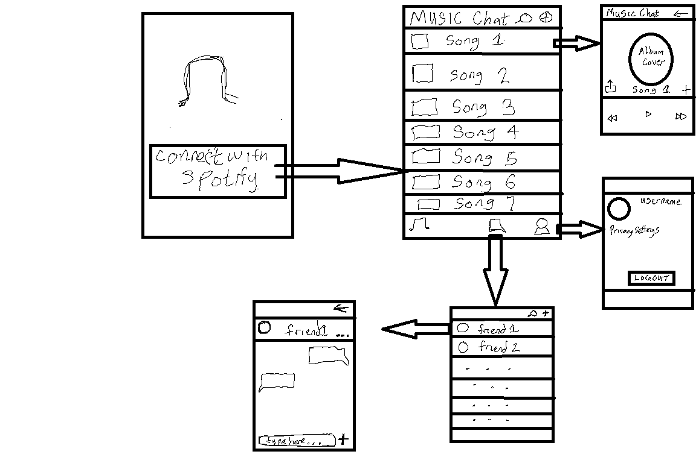

# Music-Chat

## Table of Contents
1. [Overview](#Overview)
1. [Product Spec](#Product-Spec)
1. [Wireframes](#Wireframes)
2. [Schema](#Schema)

## Overview
### Description
Spotify-like app where people can create a playlist or listen to any music. It will also have a chat activity where people can send messages, share music and listen to specific music at the same time.

### App Evaluation
- **Category:** Music / Social Networking
- **Mobile:** It will primarily be for Mobile because people usually listen to music on their phones and will be of easier access to chat and share music anytime and anywhere.
- **Story:** People can listen to specific music and add the music they like to a playlist. They can also share music with the people they want to and listen to specific music at the same time.
- **Market:** Any individual could choose to use this app, and to keep it a safe environment.
- **Habit:** This app could be used as often or unoften as the user wanted depending on how often they listen to music and how willing they are to share music and playlists in chat.
- **Scope:** First, users will start with listening to music, then they can add the music to a playlist and/or share it with other users. They can also chat with users they share music too, then perhaps this could evolve into an app that allows multiple users to listen to the same music at the same time. Large potential for use with Spotify, apple music, or other music streaming applications.

## Product Spec

### 1. User Stories (Required and Optional)

**Required Must-have Stories**
- [x] User can access a login in Activity that prompts them to log in to spotify
- [x] User can authenticate using spotify 
- [x] User can switch between different tabs - Home Activity, Chat Activity and Profile Activity using fragments and a Bottom Navigation View.
- [x] Users can view their profile
- [x] Users can scroll through a list of music 
- [x] User can click on specific music to get a detailed view of the song
- [ ] Users can play, pause, and change the song being played
- [ ] Users can share music
- [ ] Users can chat with other users

**Optional Nice-to-have Stories**

- [ ] Multiple users can listen to the same music at the same time
- [ ] Users can add songs to a playlist
- [ ] Section songs in genre or albums
- [ ] Users can modify their username 

## Video Walkthrough

Here's a walkthrough of implemented user stories:


GIF created with [LiceCap](http://www.cockos.com/licecap/).

### 2. Screen Archetypes

* Login 
   * Activity where users can log in to their account.
* Profile Screen
   * Activity where a user can see their profile picture, username, privacy settings, and a logout button.
* Messaging Screen
  * Activity for users to see all of their chats and can click on a specific chat to send a message.
* Song Selection Screen(Home)
  * Users can scroll through a list of songs and select which one they wish to listen to.
* Song Player Screen
  * Users can see more details about the songs they selected or the song being played and they can pause, play, forward/backward, or change the song.
  * Users can share the song and also put it in a playlist.


### 3. Navigation

**Tab Navigation** (Tab to Screen)

* Song Selection
* Profile
* Search
* Messaging Screen

**Flow Navigation** (Screen to Screen)

* Forced log-in 
   * Song Selection Screen (home)
* Song Selection Screen
   * Song Player Screen
   * Messaging Screen
   * Profile
* Song Player Screen
   * Messaging Screen
* Messaging Screen
   * Specific Chat
* Profile
   * Change Profile Image
   * Log-out


## Wireframes



### [BONUS] Digital Wireframes & Mockups

### [BONUS] Interactive Prototype

## Schema 
[This section will be completed in Unit 9]
### Models

## Message
| Property  | Type | Description  |
| ------------- | ------------- | ------------- |
| objectId  | String   | Unique id for a message   |
| author  | Pointer to User | To identify a message sender  |
| message  | String   | The message sent   |
| sentAt  | DateTime | Date when a message is sent  |
| receiver   | Pointer to User   | To identify who a message is being sent to   |
| sharedSongs  | String  | The url of the song that is shared  |


### Networking
## List of network requests by screen
* Messaging Screen 
   * (Read/GET) Query all messages where the user is author and receiver.
   ```swift
  let query = PFQuery(className:"Message")
  query.whereKey(("author", equalTo: currentUser) && ("receiver", equalTo: currentFriend) && ("author", equalTo: currentFriend) && "receiver", equalTo: currentUser)
  query.order(byDescending: "createdAt")
  query.findObjectsInBackground { (messages: [PFObject]?, error: Error?) in
     if let error = error { 
        print(error.localizedDescription)
     } else if let messages= messages {
        print("Successfully retrieved \(messages.count) messages.")
      // TODO: Display messages accordingly...
     }
  }
  ```
    * (Create/POST) Create a new message. 
### [OPTIONAL:] Existing API Endpoints 
 * Base URL - https://developer.spotify.com/documentation/web-api/


| HTTP Verb  | Endpoint | Description  |
| ------------- | ------------- | ------------- |
| GET  | /users/user_id/playlists   | Get user’s playlist  |
| GET  | /playlists/playlist_id/tracks  | Get tracks in a playlist  |
| POST  | /users/user_id/playlists   | Creates playlist   |
| GET  | /search?type=album&include_external=audio | Search for an item/song  |
| GET   | /me/player   | Get playback state  |
| GET  | /me/player/currently-playing  | Get current playing track |
